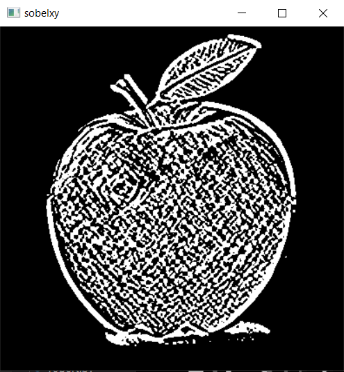

# Computer Vision Course Tasks

In this Repository, we present a variety of Image Processing Techniques implemented from scratch using Python with help of some helpful packages.

## Installation

### Script's Components
- Numpy     
- opencv-python   
- Matplotlib  
- scipy
- math

## Task 1: Filtering And Edge detection
In this section, we present some implementations such as adding noise to an image, filtering the added noise, viewing different types of histograms, applying equalization and edge detection techniques as well as normalization to an image.

- Original Image
-  
-  Gray Scaled Image 
-  

### 1.1 Add additive noise to the image 
- 1.1.1 Uniform Noise 
- 

- 1.1.2 Gaussian Noise 
- 
- 1.1.3 Salt & Pepper Noise 
- 

### 1.2 Filter the noise
- 1.2.1 Average Filter 
- 
- 1.2.2 Gaussian Filter 
- 
- 1.2.3 Median Filter 
- 

### 1.3 Edge Detection masks
- 1.3.1 Sobel 
- 

- 1.3.2 Roberts
- 

- 1.3.3 Prewitt 
- 

- 1.3.4 Canny 
- 

### 1.4 Histogram and Distribution Curve
- 1.4.1 Histogram 
- 

- 1.4.2 Distribution Curve
- 

### 1.5 Equalization of the image

- 
### 1.6 Normalization of the image 

- 
  

